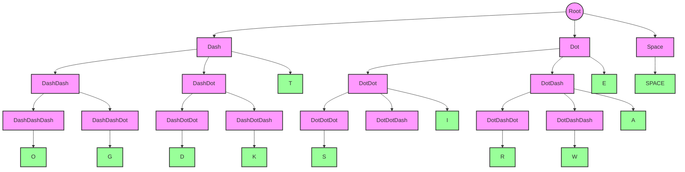

# Morse Code Implementations

This folder contains different implementations of Morse code encoding and decoding, each demonstrating a different approach to the problem.

## Implementation Overview

### morse1.ts

Simple map-based implementation using a direct mapping between characters and their Morse code representations.

### morse2.ts

Alternative implementation using a map-based approach with improved structure.

### morse3.ts

Implementation using nested if-else statements for decoding. This approach is less maintainable due to its complex nested structure.

### morse4.ts

Tree-based state machine implementation that provides the best balance of readability, maintainability, and efficiency.

## State Machine Visualization (morse4.ts)

The state machine in morse4.ts is implemented as a tree structure:



### How the State Machine Works

1. The tree structure represents all possible Morse code patterns:

   - Root node (empty string) branches to dash, dot, and space
   - Each node can have multiple children
   - Edges are labeled with "." (dot), "-" (dash), or "/" (space)
   - Leaf nodes contain the decoded character

2. Decoding process:

   - Start at root node
   - Follow path of dots and dashes
   - Leaf node reached contains the decoded character

3. Example paths:
   - "." → E
   - "-" → T
   - ".-" → A
   - "..." → S
   - "---" → O

## Usage Example

```typescript
import { textToMorse, morseToText } from "./morse4";

// Encode text to Morse code
const morse = textToMorse("HELLO WORLD");
console.log(morse); // ".... . .-.. .-.. --- / .-- --- .-. .-.. -.."

// Decode Morse code to text
const text = morseToText(".... . .-.. .-.. --- / .-- --- .-. .-.. -..");
console.log(text); // "HELLO WORLD"
```

## Implementation Comparison

| Implementation | Approach       | Pros                                   | Cons                                |
| -------------- | -------------- | -------------------------------------- | ----------------------------------- |
| morse1.ts      | Simple map     | Easy to understand, direct mapping     | Less flexible, no pattern matching  |
| morse2.ts      | Map-based      | Better structure, more maintainable    | Still lacks pattern matching        |
| morse3.ts      | Nested if-else | Works correctly                        | Hard to maintain, complex nesting   |
| morse4.ts      | State machine  | Most readable, maintainable, efficient | Slightly more complex initial setup |
